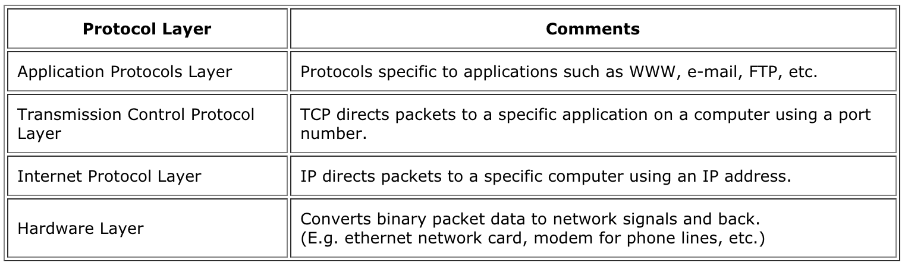
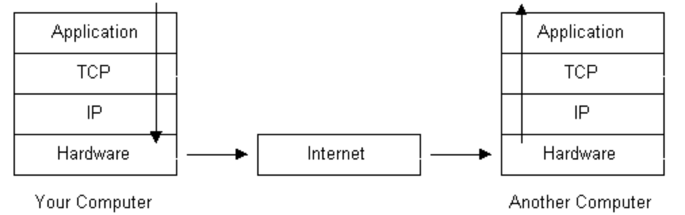

## General Information about Networking

Before learning about the web server, let's take a look at some general information about how networking works. Some of these terms will be familiar to you, and we'll expand their definitions a bit.

### Networking Protocols

_This is background information. You will not need to use this directly in the web server._

A _protocol_ is an agreement between two programs about how they will communicate. For the Internet, most protocols take the form of "If you send me _x_, I'll send you back _y_." Internet-related protocols are clearly written
down in specifications, known as an _RFC_.

When you send some data out on the network, that data is wrapped up in several layers of additional data that provide information about data integrity, routing, and so on.

At the highest level, you have your data that you want to transmit. As it is prepared for transmission on the network, the data is _encapsulated_ in other data to help it arrive at its destination. Any particular piece of data will be
wrapped, partially unwrapped, and re-wrapped as it moves from wire to wire across the Internet to its destination.

The act of wrapping data puts a new _header_ on the data. This header encapsulates the original data, _and all the headers that have been added before it_.



The details of what data exists in each header type is beyond the scope of what most people need to know. It is enough to know the short description of what each does.



As the data leaves your LAN and heads out in the world, the Ethernet header, which is responsible with routing specifically over the Local Area Network, will be stripped off, the IP header will be examined to see how the data should be routed, and another header for potentially a different protocol will be put on to send the traffic over DSL, a cable modem, or fiber.

The Ethernet header is created and managed by the network drivers in the OS.

### Sockets

_This is background information. You will not need to use this directly in the web server. This code is written for you._

Under Unix-like operating systems, the _sockets API_ is the one used to send Internet traffic. It supports both the TCP and UDP protocols, and IPv4 and IPv6.

The sockets API gives access to the IP and TCP layers in the diagram above.

A _socket descriptor_ is a number used by the OS to keep track of open connections. It is used to send and receive data. In our web server, this variable is called `fd`.

You can create a new socket (socket descriptor) with the `socket()` system call.

Once created you still have to _bind_ it to a particular IP address (which the OS associates with a particular network card). This is done with the `bind()` system call.

Once bound, you can read and write data to the socket using the `recv()` and `send()` system calls.

* See also [Beej's Guide to Network Programming](https://beej.us/guide/bgnet/)

## HTTP

_In the webserver, you will be writing code that parses down strings that hold HTTP requests, and builds strings that hold HTTP responses. Study what an HTTP request and response look like._

The final piece of information needed for web traffic is the _HyperText Transport Protocol_ (HTTP). While TCP deals with general data integrity and IP deals with routine, HTTP is concerned with `GET` and `POST` requests of web data.

Like the other stages of networking, HTTP adds a header before the data it wants to send with the packet. Like IP and TCP, this header has a well-defined specification for exactly what needs to be sent.

Though the specification is complex, fortunately only a small amount of information is needed to implement a barebones version.

For each _HTTP request_ from a client, the server sends back an _HTTP response_.

Here is an example HTTP `GET` request and response using version 1.1 of the HTTP protocol getting the page `http://lambdaschool.com/example`:

```
GET /example HTTP/1.1
Host: lambdaschool.com

```

And here is a sample HTTP response:

```
HTTP/1.1 200 OK
Date: Wed Dec 20 13:05:11 PST 2017
Connection: close
Content-Length: 41749
Content-Type: text/html

<!DOCTYPE html><html><head><title>Lambda School ...
```

The end of the header on both the request and response is marked by a blank line (i.e. two newlines in a row).

If the file is not found, a `404` response is generated and returned by the server:

```
HTTP/1.1 404 NOT FOUND
Date: Wed Dec 20 13:05:11 PST 2017
Connection: close
Content-Length: 13
Content-Type: text/plain

404 Not Found
```

If you've ever looked in the Network panel of your web browser's debugger, some of these headers might look familiar.

Important things to note:

* For HTTP/1.1, the request **must** include the `Host` header.
* The second word of the first line of the response gives you a success or failure indicator.
* `Content-Length` gives the length of the request or response body, not counting the blank line between the header and the body.
* `Content-Type` gives you the MIME type of the content in the body. This is how your web browser knows to display a page as plain text, as HTML, as a GIF image, or anything else. They all have their own MIME types.
* Even if your request has no body, a blank line still **must** appear after the header.
* `Connection: close` tells the web browser that the TCP connection will be closed after this response. This should be included.
* The `Date` should be the date right now, but this field is optional.